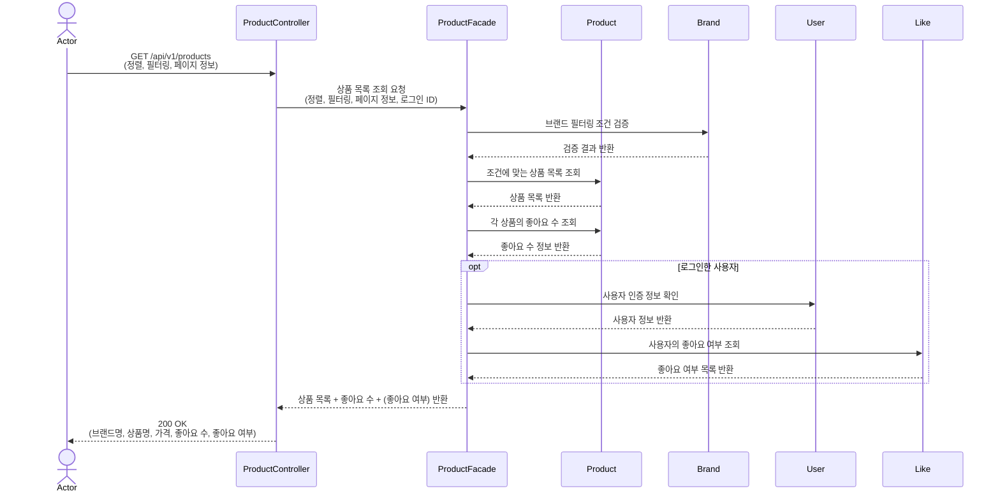
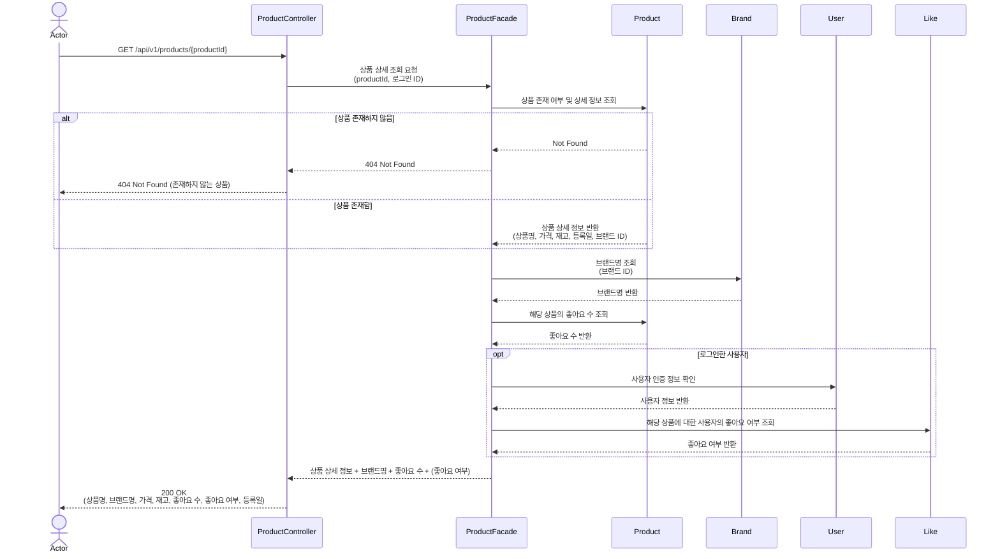
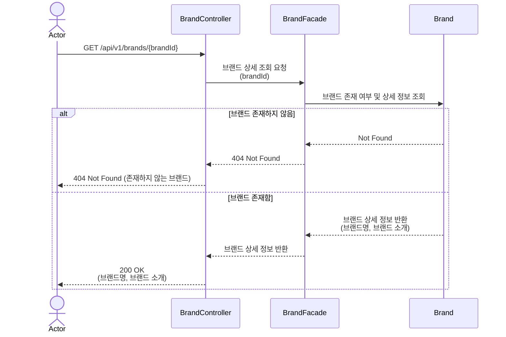
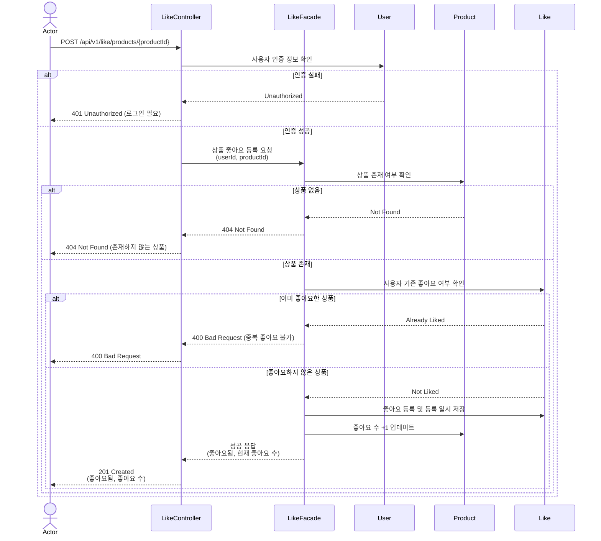
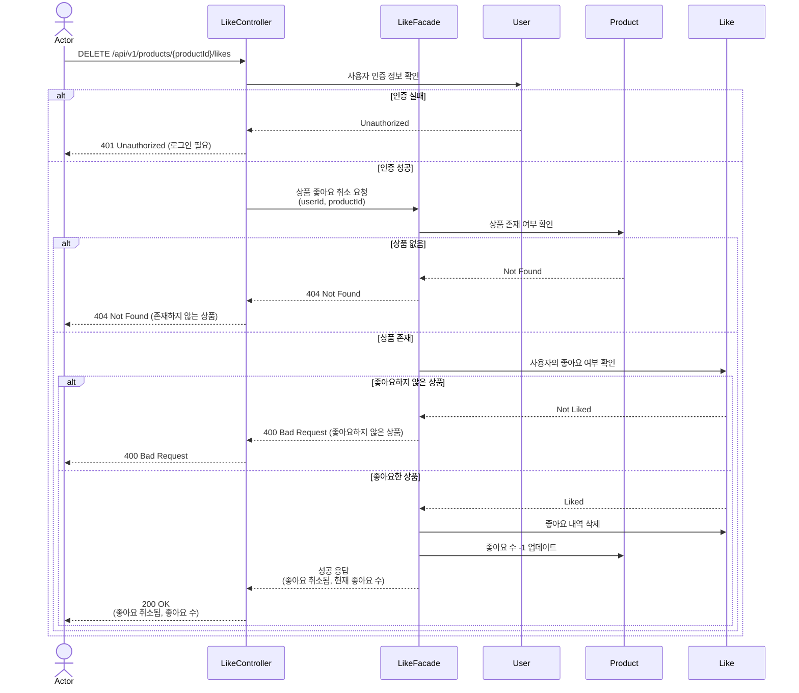
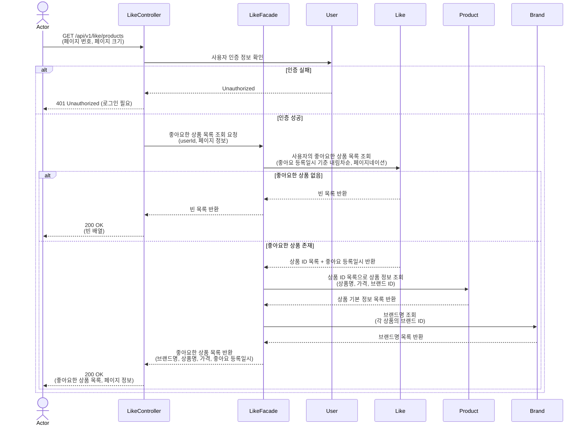
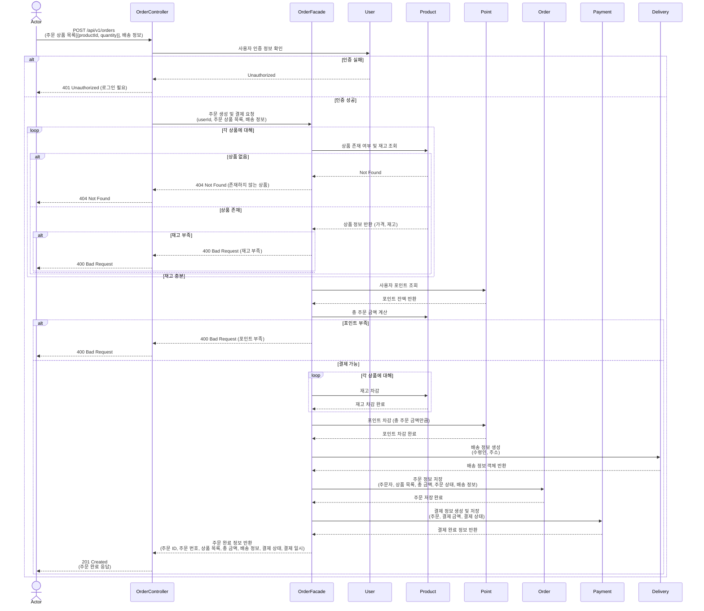
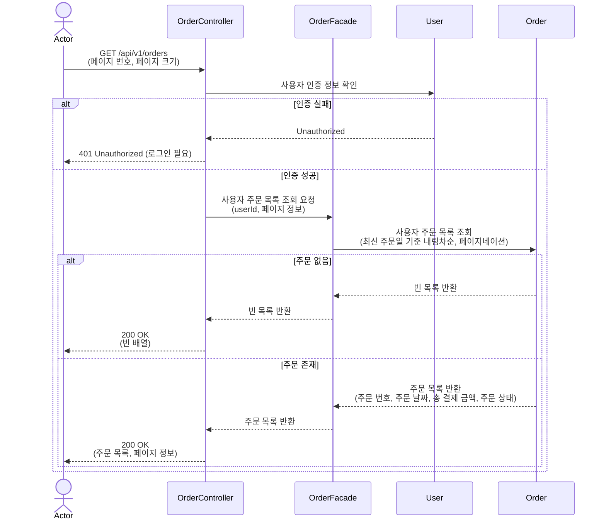
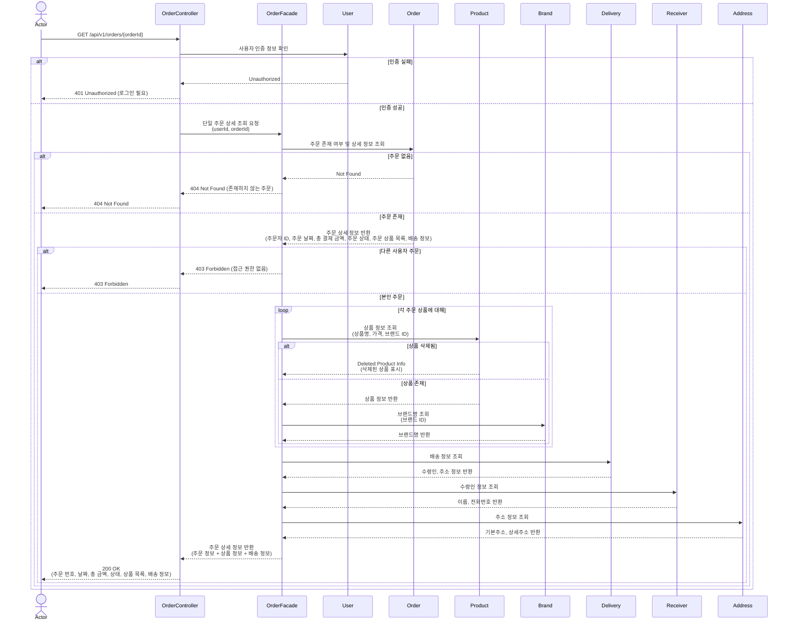

## 1. 상품 목록 조회

---

## 2. 상품 상세 조회

---

## 3. 브랜드 정보 조회

---

## 4. 상품 좋아요 등록

---

## 5. 상품 좋아요 취소

---

## 6. 좋아요한 상품 목록 조회

---

## 7. 주문 요청 

---

## 8. 유저 주문 목록 조회

---

## 9. 단일 주문 상세 조회

