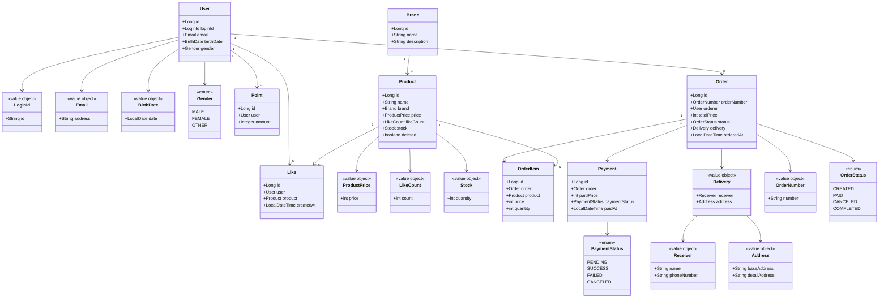

```mermaid
classDiagram
    class User {
        +Long id
        +LoginId loginId
        +Email email
        +BirthDate birthDate
        +Gender gender
    }

    class LoginId {
        <<value object>>
        +String id
    }

    class Email {
        <<value object>>
        +String address
    }

    class BirthDate {
        <<value object>>
        +LocalDate date
    }

    class Gender {
        <<enum>>
        MALE
        FEMALE
        OTHER
    }

    class Point {
        +Long id
        +User user
        +Integer amount
    }

    class Like {
        +Long id
        +User user
        +Product product
        +LocalDateTime createdAt
    }
    
    class Product {
        +Long id
        +String name
        +Brand brand
        +ProductPrice price
        +LikeCount likeCount
        +Stock stock
        +boolean deleted
    }

    class Brand {
        +Long id
        +String name
        +String description
    }

    class ProductPrice {
        <<value object>>
        +int price
    }

    class LikeCount {
        <<value object>>
        +int count
    }

    class Stock {
        <<value object>>
        +int quantity
    }

    class Order {
        +Long id
        +OrderNumber orderNumber
        +User orderer
        +int totalPrice
        +OrderStatus status
        +Delivery delivery
        +LocalDateTime orderedAt
    }

    class OrderItem {
        +Long id
        +Order order
        +Product product
        +int price
        +int quantity
    }

    class Payment {
        +Long id
        +Order order
        +int paidPrice
        +PaymentStatus paymentStatus
        +LocalDateTime paidAt
    }

    class Delivery {
        <<value object>>
        +Receiver receiver
        +Address address
    }

    class OrderNumber {
        <<value object>>
        +String number
    }

    class Receiver {
        <<value object>>
        +String name
        +String phoneNumber
    }

    class Address {
        <<value object>>
        +String baseAddress
        +String detailAddress
    }

    class OrderStatus {
        <<enum>>
        CREATED
        PAID
        CANCELED
        COMPLETED
    }

    class PaymentStatus {
        <<enum>>
        PENDING
        SUCCESS
        FAILED
        CANCELED
    }

    User "1" --> "N" Like
    User "1" --> "1" Point
    User "1" --> "N" Order
    User --> Gender
    User --> LoginId
    User --> Email
    User --> BirthDate

    Order "1" --> "1" Payment
    Order "1" --> "N" OrderItem
    Order --> OrderStatus
    Order --> Delivery
    Order --> OrderNumber
    Delivery --> Receiver
    Delivery --> Address
    Payment --> PaymentStatus

    Product "1" --> "N" OrderItem
    Product "1" --> "N" Like
    Brand "1" --> "N" Product
    Product --> ProductPrice
    Product --> LikeCount
    Product --> Stock
```