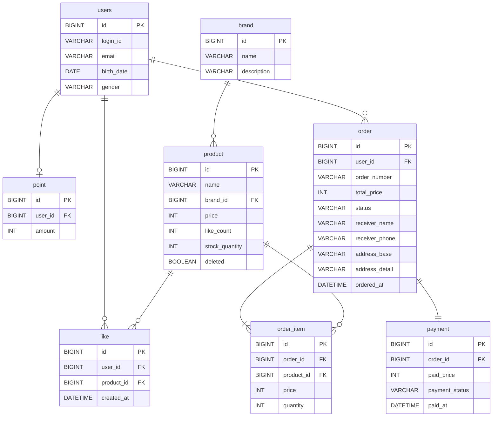

```mermaid
erDiagram
    users {
        BIGINT id PK
        VARCHAR login_id
        VARCHAR email
        DATE birth_date
        VARCHAR gender
    }

    point {
        BIGINT id PK
        BIGINT user_id FK
        INT amount
    }

    like {
        BIGINT id PK
        BIGINT user_id FK
        BIGINT product_id FK
        DATETIME created_at
    }

    product {
        BIGINT id PK
        VARCHAR name
        BIGINT brand_id FK
        INT price
        INT like_count
        INT stock_quantity
        BOOLEAN deleted
    }

    brand {
        BIGINT id PK
        VARCHAR name
        VARCHAR description
    }

    order {
        BIGINT id PK
        BIGINT user_id FK
        VARCHAR order_number
        INT total_price
        VARCHAR status
        VARCHAR receiver_name
        VARCHAR receiver_phone
        VARCHAR address_base
        VARCHAR address_detail
        DATETIME ordered_at
    }

    order_item {
        BIGINT id PK
        BIGINT order_id FK
        BIGINT product_id FK
        INT price
        INT quantity
    }

    payment {
        BIGINT id PK
        BIGINT order_id FK
        INT paid_price
        VARCHAR payment_status
        DATETIME paid_at
    }

    users ||--o{ like : ""
    users ||--o| point : ""
    users ||--o{ order : ""

    order ||--|{ order_item : ""
    order ||--|| payment : ""
    product ||--o{ order_item : ""
    product ||--o{ like : ""
    brand ||--o{ product : ""
```